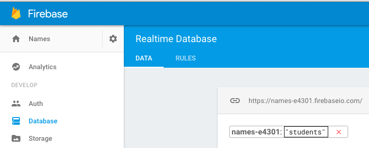
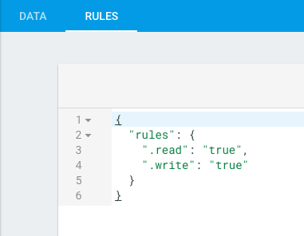

BulletinBoard is a very simple multi-user bulletin board app. It uses CloudKit for both persistence and sync. It will help the students practice and understand CloudKit concepts including querying, saving, and subscriptions in a very simple app, without any local persistence.

**Look over the README in the root folder of this repository**

# Suggested breakdown for BulletinBoard

Instructor preparation (students need not do this):

1. Create a new project on Firebase
2. In the Database section, create an endpoint with a resonable name:

    
    
3. Note the URL at the top of the database panel, e.g. https://names-e4301.firebaseio.com/. You will need this when writing the app.

4. On the rules tab, change read and write to true:

    
    

*Start this project from scratch*

1. Set up the table view controller in the storyboard.
2. Create the `Student` model.
3. Add an extension to `Student` with functionality related to JSON.
4. Create or copy the `NetworkController` from another project. Note that it is generic.
5. Create the model controller, `StudentController`. Explain that we use PUT to create/add new data on an API.
6. Create `StudentTableViewController` including methods to fetch students, add new ones, and display them.
7. Students should be able to run the app, and add their name to the list. Relaunching the app should show all students that have been submitted to the API.